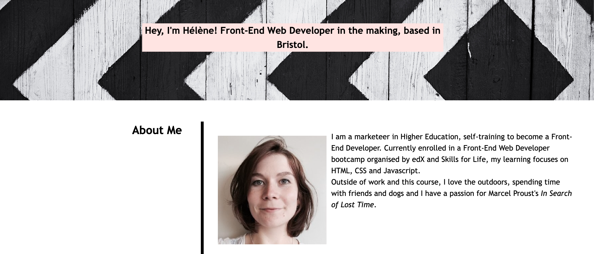

# Unit 2 Challenge: Portfolio

## Description

This project is the second challenge of the Front-End Web Developer Bootcamp. The goal is to make a portfolio using skills learned during the course, as well as creating a portfolio that can be used during future job search.
 
For this project, I used the CSS:

- flexbox: to create two columns (one for headings on the left, the other on the right with the rest of the content).

- grid: to showcase the different projects I have been working on.

- media queries: to make sure the website is responsive when viewed from different devices.

### Deployment: 

The website can be viewed [here.](https://helenesauve.github.io/Professional_Portfolio/)

The page resembles the below screenshot:

